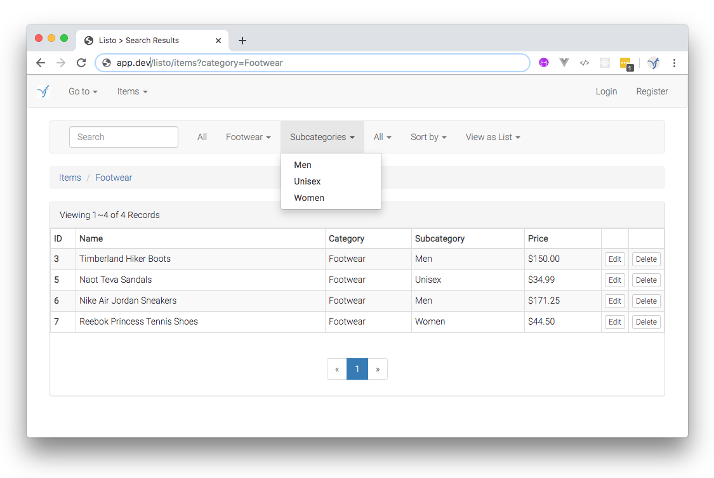

# Listo

[](LICENSE.md)

Extends the Ligero BREAD micro-framework for Laravel, adding dynamic contextual UI controls supporting complex search architectures.

Quick-Links:

- [Installation](#installation)
- [Overview](#overview)
    - [Architecture](#architecture)
    - [Live Demo](#live-demo)
- [Enhancements to Ligero](#enhancements-to-ligero)
    - [Config (PublisherConfigInterface)](#config-publisherconfiginterface)
    - [Publisher (PublisherInterface)](#publisher-publisherinterface)
    - [PublisherApi (PublisherApiInterface)](#publisherapi-publisherapiinterface)
    - [Repository (PublisherRepositoryInterface)](#repository-publisherrepositoryinterface)
- [Customization](#customization)
    - [Publishing the Package Files](#publishing-the-package-files)
    - [Extending or Decorating Base Classes](#extending-or-decorating-base-classes)
    - [Namespace for Custom Classes](#namespace-for-custom-classes)
- [Tests](#tests)
- [License](#license)
- [Contributing](#contributing)

## Installation

Via Composer:

```bash
$ composer require viewflex/listo
```

After installing, add the `ListoServiceProvider` to the list of service providers in Laravel's `config/app.php` file.

```php
Viewflex\Listo\ListoServiceProvider::class,
```

## Overview

### Architecture

This package extends the `viewflex/ligero` package, enhancing the Ligero BREAD micro-framework with additional dynamic UI controls supporting complex search architectures. It also has it's own demo implementation that includes the additional UI controls provided. This documentation should be viewed as a supplement to the official [Ligero Documentation](https://github.com/viewflex/ligero-docs).

### Live Demo



The Items domain is a working demo provided in this package, implementing a very simple CRUD UI in plain HTML with Bootstrap.css, but of course the generated API data sent to the views could be presented using any front-end framework desired.

Listo provides a complete separation of presentation and application logic, and outputs results with all necessary data elements for dynamic UI components, pre-packaged in a standardized format. Use the 'Items > Display as JSON' menu command to see what the raw data looks like.

#### Using the Demo as a Template

See the [Publishing the Package Files](#publishing-the-package-files) subsection below to learn how to quickly scaffold new domains by publishing (copying) the demo and customizing it to suit the requirements.

#### Demo API Endpoints

Besides the UI controller used in the demo, there is also a ready-made Context and API controller serving the API routes for the same Items domain. The package `ContextApiController` can be used to serve any number of domain Contexts via route parameter keyed to the configured `$contexts` array.


## Enhancements to Ligero

Listo adds some new UI elements to what's already available in the Ligero package. Please see the Ligero documentation to understand how dynamic UI controls are configured and used.

Additional highly configurable dynamic query controls are provided by this package, including:

* Breadcrumbs
* Query Menus
* Sort Menu

These are the upgraded interfaces, and the methods added to them:

### Config `PublisherConfigInterface`

This package's `Config/listo.php` file provides defaults for the global settings in `BasePublisherConfig`, and can be published (via artisan command) to the Laravel `config` directory for customization (see the [Customization](#customization)  section below). If upgrading from Ligero to Listo, note that this config file will now be used instead of the `ligero.php` config file.

#### Domain Configuration

##### Breadcrumbs

```php
getBreadcrumbsConfig()
setBreadcrumbsConfig($breadcrumbs_config)
```

##### Query Menus

```php
getQueryMenusConfig()
setQueryMenusConfig($query_menus_config)
```

##### Sort Menu

```php
getSortMenuConfig()
setSortMenuConfig($sort_menu_config)
```

### Publisher `PublisherInterface`

#### Raw Data

Get data for additional dynamic UI controls.

```php
getBreadcrumbs()
getQueryMenus()
getSortMenu()
```

### PublisherApi `PublisherApiInterface`

#### Raw Data

Get data for additional dynamic UI controls.

```php
getBreadcrumbs()
getQueryMenus()
getSortMenu()
```

### Repository `PublisherRepositoryInterface`

#### Menu Building

This command supports generation of query menus for individual columns, returning a list of distinct column values in `query` (in context of current query) or `global` (fresh search) scope. Supported column types: `string`, `number`, and `boolean`.

```php
distinctColumn($name = 'id', $scope = 'query', $type = 'string')
```

#### Multi-Record List Actions

Additional list actions supported:

- Sort Higher
- Sort Lower
- Show
- Hide

## Customization

This package comes with a demo domain, 'Items', that provides examples of publishing a domain with both a UI controller and an API controller. This demo can be used without using `php artisan vendor:publish` to copy the files for modification, but to either play around with the demo 'Items' domain or create new domains for your application, just use the `publish` command with the `listo` tag (as described below).

Copy and rename the demo files you need and change the class names, to implement Publishers for custom domains. Copy and rename the resource files (views and lang), and customize as needed.


### Publishing the Package Files

The package service provider configures `artisan` to publish specific file groups with tags. There are several options available in this package.

#### Routes

Run this command to publish the `routes.php` file to the project's `publish/viewflex/listo` directory for customization:

```bash
php artisan vendor:publish  --tag='listo-routes'
```

#### Config

Run this command to publish the `listo.php` config file to the project's `config` directory for customization:

```bash
php artisan vendor:publish  --tag='listo-config'
```

#### Resources

Run this command to publish the blade templates for the demo UI, and lang files for package messages and UI strings:

```bash
php artisan vendor:publish  --tag='listo-resources'
```

#### Routes, Demo Migration and Seeder

Run this command to install the migration and seeder for the 'Items' demo domain:

```bash
php artisan vendor:publish  --tag='listo-data'
```

After publishing the demo migration and seeder, run the migration:

```bash
php artisan migrate
```

Then run the seeder:

```bash
php artisan db:seed --class="ListoSeeder"
```

#### Routes, Config, Resources, Demo Migration and Seeder

Use this command to publish config, demo views, and lang files for modification. The demo migration and seeder are also copied to their proper directories:

```bash
php artisan vendor:publish  --tag='listo'
```

### Extending or Decorating Base Classes

Listo's architecture is based on distinct pattern of class types, each defined by an interface; since classes relate to each other as abstract types, you can easily substitute your own custom classes, provided that they implement the same interfaces. In fact, Listo follows the same strategy pattern as the Ligero package which it extends.

### Namespace for Custom Classes

The `Viewflex\Listo\Publish` namespace, corresponding to the `publish/viewflex/listo` directory, is recognized by the package, and is intended for organization of your custom classes. The Items demo classes will be published (copied) to this directory for customization.

## Tests

The phpunit tests can be run in the usual way, as described in the [Test Documentation](TESTS.md).

## License

This software is offered for use under the [MIT License](LICENSE.md).

## Changelog

Release versions are tracked in the [Changelog](CHANGELOG.md).